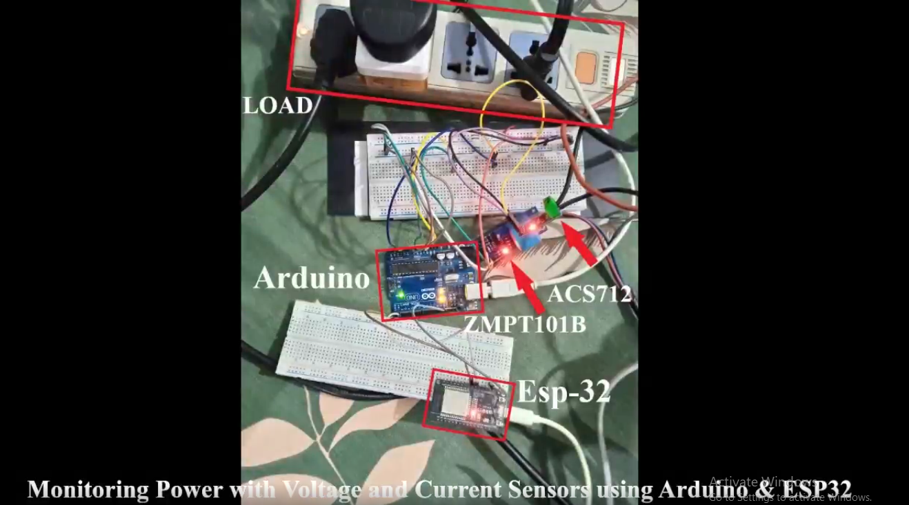
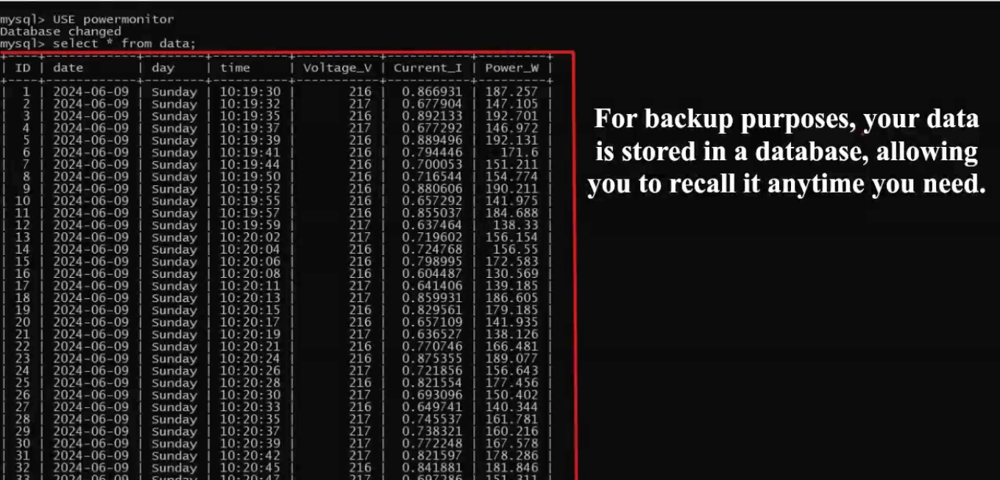
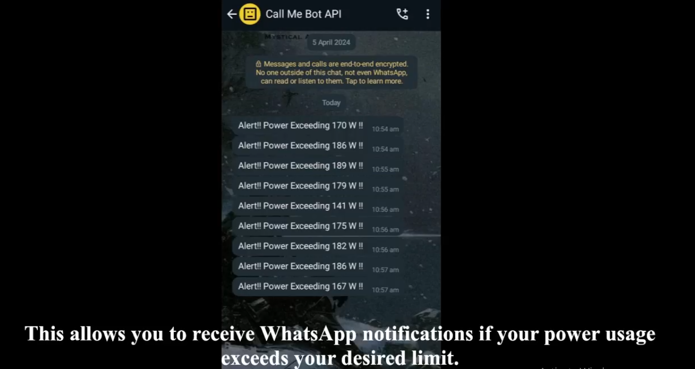
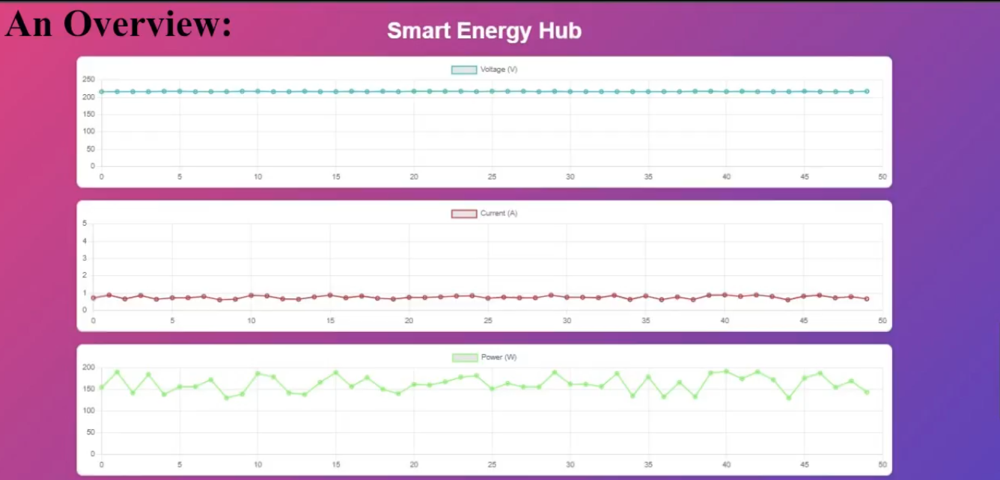

# 📡 **Smart Energy Monitoring System**

A complete IoT-powered smart energy monitoring system that measures **voltage**, **current**, and **power consumption** in real time using Arduino sensors, transmits the data to an ESP32 using **serial communication**, stores the readings in a **MySQL database**, visualizes them through a **Flask + Chart.js dashboard**, and sends **WhatsApp alerts** when consumption crosses a safe threshold.

---

## 🔥 **Features**

* Real-time voltage & current measurement
* Accurate sensing using **ACS712** (current) & **ZMPT101B** (voltage)
* Serial communication between **Arduino UNO → ESP32**
* ESP32 uploads data to **MySQL** for logging & machine learning
* Flask backend for viewing **live graphs** (voltage/current/power)
* **WhatsApp notifications** via CallMeBot when power exceeds limits
* ML-ready dataset for load prediction and anomaly detection
* Fully scalable for home or industrial applications

---

## 🧰 **Hardware Used**

| Component                   | Purpose                                    |
| --------------------------- | ------------------------------------------ |
| **Arduino UNO**             | Reads real-time analog sensor data         |
| **ACS712 Current Sensor**   | Measures AC current                        |
| **ZMPT101B Voltage Sensor** | Measures AC voltage                        |
| **ESP32**                   | Serial communication, WiFi, data uploading |
| Jumper cables               | Connections                                |
| AC Load                     | Test load                                  |

---

## 🧪 **Software Used**

* **Arduino IDE** (sensor reading + JSON formatting)
* **ESP32 MicroPython** (serial + HTTP + MySQL)
* **Flask** (API backend + dashboard)
* **Chart.js** (live graph visualization)
* **MySQL** (data logging + future ML training)
* **CallMeBot API** (WhatsApp alerts)

---

## 🔌 **System Architecture**

```
[Sensors: ACS712 + ZMPT101B]
                ↓
           [Arduino UNO]
      Reads analog values → Sends JSON over UART
                ↓ 9600 baud
                ↓
              [ESP32]
 Receives JSON → Calculates Power → Stores in MySQL
 Sends WhatsApp alert if power > threshold
                ↓
           [MySQL Database]
      Voltage | Current | Power | Timestamp
                ↓
            [Flask Server]
     API + Realtime Graph Dashboard (Chart.js)
                ↓
           [User Interface]
```





---

## 📥 **Data Flow**

1. **Arduino** reads voltage + current
2. Converts to JSON → sends via Serial
3. **ESP32** receives JSON
4. Calculates **power = V × I**
5. Stores into **MySQL database**
6. Flask displays live data on dashboard
7. If power > threshold → **WhatsApp alert triggered**

---

## 📡 **Serial Communication (Arduino → ESP32)**

* Uses UART at **9600 baud rate**
* Data format example:

```json
{
  "Voltage": 227.5,
  "Current": 1.42
}
```

* ESP32 parses JSON and pushes to MySQL.

---

## 🗂️ **Database Structure**

A MySQL table named `data`:

| Column    | Type    | Description     |
| --------- | ------- | --------------- |
| ID        | INT     | Auto increment  |
| date      | DATE    | Record date     |
| day       | VARCHAR | Day of week     |
| time      | TIME    | Time of reading |
| Voltage_V | FLOAT   | Voltage (V)     |
| Current_I | FLOAT   | Current (A)     |
| Power_W   | FLOAT   | Power (W)       |




This makes the data **ready for ML training**, such as:

* Load forecasting
* Anomaly detection
* Fault prediction
* Behavioral modeling

---

## 📲 **WhatsApp Alert System**

* Uses **CallMeBot API**
* ESP32 automatically sends a WhatsApp message when:

```
Power_W > threshold (e.g., 500W)
```

**Alert Example:**

> ⚠️ Power Alert!
> Load is consuming 520W which exceeds safety limit.





---

## 💻 **Flask API Endpoints**

### **POST /api/update-dht-data**

Used by ESP32 to send data.

Payload:

```json
{
  "Voltage": 220,
  "Current": 1.5
}
```

### **GET /api/get-graph-data**

Returns live history for Dashboard (Chart.js)

---

## 📊 **Real-Time Dashboard**

Flask renders a page showing:

* Live voltage graph
* Live current graph
* Live power consumption

Updated every second using AJAX.



---

## ⚙️ **Installation & Setup**

### **Arduino**

1. Install **ArduinoJson**, **ACS712**, **ZMPT101B** libraries
2. Upload the Arduino sketch
3. Connect sensors properly

---

### **ESP32**

1. Flash **MicroPython** firmware
2. Upload ESP32 script
3. Enter your WiFi + MySQL credentials
4. ESP32 will automatically create DB & table

---

### **Flask Server**

```bash
pip install flask mysql-connector-python
python app.py
```

---

## 🌱 **Machine Learning Usage**

Since MySQL stores a continuous time-series dataset:

You can build ML models for:

* Predicting future power consumption
* Detecting abnormal spikes
* Classifying load type
* Forecasting energy usage
* Reinforcement learning for energy optimization

---

## 🤖 **Future Improvements**

* Add energy billing estimation
* Train ML model and integrate into Flask
* Add device control (turn off load automatically)
* Add MQTT support
* Deploy dashboard to cloud

---

## 🏁 **Conclusion**

This project integrates **embedded systems**, **IoT**, **real-time data visualization**, **database engineering**, and **alert automation** into a single, scalable smart energy monitoring system. It is suitable for smart homes, industrial monitoring, IoT learning, and predictive maintenance research.

